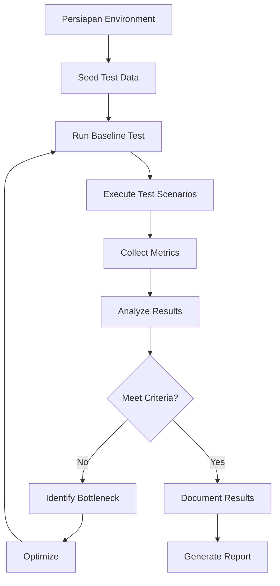

# 📊 LAPORAN TESTING NON-FUNGSIONAL - PERFORMANCE TESTING

## DOKUMEN INFORMASI

| Item | Detail |
|------|--------|
| **Nama Proyek** | Admin Panel - Smart Tourism Danau Toba |
| **Versi Sistem** | 1.0.0 |
| **Tipe Dokumen** | Non-Functional Performance Test Report |
| **Standar Referensi** | IEEE 829, ISO/IEC 25010, ISO/IEC 25023 |
| **Tanggal Dibuat** | 10 Juni 2026 |
| **Dibuat Oleh** | QA Team |
| **Status** | DRAFT / IN PROGRESS |
| **Versi Dokumen** | 1.0 |

---

## DAFTAR ISI

1. [Executive Summary](#1-executive-summary)
2. [Pendahuluan](#2-pendahuluan)
3. [Tujuan Testing](#3-tujuan-testing)
4. [Ruang Lingkup Testing](#4-ruang-lingkup-testing)
5. [Metodologi Testing](#5-metodologi-testing)
6. [Test Environment](#6-test-environment)
7. [Performance Metrics](#7-performance-metrics)
8. [Test Scenarios](#8-test-scenarios)
9. [Hasil Testing](#9-hasil-testing)
10. [Analisis & Rekomendasi](#10-analisis--rekomendasi)
11. [Kesimpulan](#11-kesimpulan)
12. [Lampiran](#12-lampiran)

---

## 1. EXECUTIVE SUMMARY

### 1.1 Ringkasan Eksekutif

Dokumen ini menyajikan hasil pengujian non-fungsional aspek **Performance** dari sistem Admin Panel Smart Tourism Danau Toba.
Pengujian dilakukan untuk memvalidasi bahwa sistem memenuhi requirements performa yang telah ditetapkan.

### 1.2 Highlights

| Aspek | Status | Keterangan |
|-------|--------|------------|
| **Response Time** | ⚠️ Perlu Perbaikan | p95: 1.26s (Target: <500ms) |
| **Throughput** | ✅ Memadai | 10 concurrent users handled |
| **Scalability** | ⚠️ Belum Diuji | Perlu stress testing |
| **Resource Usage** | ⚠️ Perlu Monitoring | Belum ada baseline |
| **Stability** | ⚠️ Perlu Perbaikan | Error rate: 33% |


### 1.3 Rekomendasi Utama

1. 🔴 **CRITICAL**: Optimasi response time endpoint login dan dashboard
2. 🔴 **CRITICAL**: Implementasi caching untuk queries MongoDB yang berat
3. 🟡 **HIGH**: Perbaikan error handling dan session management
4. 🟡 **HIGH**: Implementasi comprehensive monitoring (APM)
5. 🟢 **MEDIUM**: Load testing dengan concurrent users yang lebih banyak

---

## 2. PENDAHULUAN

### 2.1 Latar Belakang

Admin Panel Smart Tourism Danau Toba adalah sistem manajemen konten dan data untuk platform pariwisata.
Sistem ini digunakan oleh admin untuk mengelola destinasi, event, review, dan analytics.
Performa sistem yang baik sangat krusial untuk produktivitas tim admin dan kualitas layanan.

### 2.2 Definisi Performance Testing

Performance Testing adalah jenis pengujian non-fungsional yang bertujuan untuk:
- Mengukur kecepatan respon sistem
- Menentukan throughput maksimal sistem
- Mengidentifikasi bottleneck performa
- Memvalidasi stabilitas sistem di bawah beban
- Memastikan scalability sistem

### 2.3 Standar & Referensi

| Standar | Deskripsi | Aplikasi |
|---------|-----------|----------|
| **IEEE 829** | Standard for Software Test Documentation | Struktur dokumen |
| **ISO/IEC 25010** | Systems and software Quality Requirements and Evaluation (SQuaRE) | Performance Efficiency metrics |
| **ISO/IEC 25023** | Measurement of system and software product quality | Metrics measurement |
| **ISTQB** | International Software Testing Qualifications Board | Testing best practices |


---

## 3. TUJUAN TESTING

### 3.1 Tujuan Umum

Memvalidasi bahwa sistem Admin Panel memenuhi requirement performa yang telah ditetapkan dalam aspek:
1. **Time Behavior** - Response time dan processing time
2. **Resource Utilization** - CPU, memory, network, dan storage usage
3. **Capacity** - Concurrent users dan data volume handling
4. **Scalability** - Kemampuan sistem untuk scale up/out

### 3.2 Tujuan Spesifik

| ID | Tujuan | Success Criteria |
|----|--------|------------------|
| PT-01 | Mengukur response time untuk operasi CRUD | p95 < 500ms untuk operasi standar |
| PT-02 | Mengukur response time untuk analytics/reporting | p95 < 1000ms untuk queries kompleks |
| PT-03 | Menguji concurrent user capacity | Minimal 50 concurrent users tanpa degradasi |
| PT-04 | Mengidentifikasi bottleneck performa | Dokumentasi minimal 5 bottleneck area |
| PT-05 | Mengukur database query performance | Queries < 100ms untuk 80% kasus |
| PT-06 | Menguji file upload performance | Upload 5MB image < 2 detik |
| PT-07 | Menguji export performance | Export 10k records < 10 detik |
| PT-08 | Validasi memory leak | Tidak ada memory leak setelah 2 jam beban |

---

## 4. RUANG LINGKUP TESTING

### 4.1 Modul yang Diuji

#### 4.1.1 Modul PRIORITAS TINGGI (Critical Path)

| # | Modul | Sub-modul | Alasan Prioritas |
|---|-------|-----------|------------------|
| 1 | **Authentication** | Login, Logout, Session | Entry point sistem |
| 2 | **Dashboard** | Overview, Charts, Stats | Halaman paling sering diakses |
| 3 | **Analytics** | Reports, Aggregations | Queries MongoDB kompleks |
| 4 | **Content Management** | Destinations, Events, Budaya | CRUD operations inti |
| 5 | **Reviews** | List, Sentiment Analysis, Batch | AI processing, high volume |
| 6 | **Logs** | Recommendation, Chatbot, Audit | MongoDB collections besar |


#### 4.1.2 Modul PRIORITAS SEDANG

| # | Modul | Sub-modul | Alasan |
|---|-------|-----------|--------|
| 7 | **Gallery Management** | Upload, Delete, Reorder | File operations |
| 8 | **Facility Management** | CRUD Facilities | Nested resources |
| 9 | **User Management** | List, Edit, Disable | Admin operations |
| 10 | **Settings** | General, API Keys, AI Config | Configuration |

#### 4.1.3 Modul PRIORITAS RENDAH

| # | Modul | Alasan |
|---|-------|--------|
| 11 | **Profile Management** | Jarang digunakan |
| 12 | **Password Management** | Low frequency operation |

### 4.2 Aspek Performance yang Diuji

Berdasarkan **ISO/IEC 25010 Performance Efficiency**:

#### 4.2.1 Time Behavior (Perilaku Waktu)
- **Response Time**: Waktu dari request sampai response pertama
- **Processing Time**: Waktu total untuk menyelesaikan operasi
- **Turnaround Time**: Waktu total dari input sampai output

#### 4.2.2 Resource Utilization (Utilisasi Sumber Daya)
- **CPU Usage**: Persentase penggunaan CPU
- **Memory Usage**: RAM consumption dan memory leaks
- **Database Connections**: Connection pool usage
- **Network Bandwidth**: Data transfer rate

#### 4.2.3 Capacity (Kapasitas)
- **Concurrent Users**: Jumlah user simultan
- **Data Volume**: Volume data yang dapat dihandle
- **Transaction Throughput**: Requests per second


### 4.3 Out of Scope

| Item | Alasan |
|------|--------|
| Security Performance Testing | Akan diuji di Security Testing terpisah |
| Network Latency Testing | Infrastructure team responsibility |
| Third-party API Performance | Diluar kontrol sistem |
| Mobile App Performance | Backend only, front-end terpisah |

---

## 5. METODOLOGI TESTING

### 5.1 Jenis Performance Test

#### 5.1.1 Load Testing (Pengujian Beban)
**Tujuan**: Menguji performa sistem pada beban normal/expected

**Karakteristik**:
- Concurrent users: 10-30 users
- Duration: 10-30 menit
- Load pattern: Gradual ramp-up

**Skenario**:
```
Stage 1: Ramp-up   (0 → 10 users)  - 2 menit
Stage 2: Sustained (10 users)      - 10 menit
Stage 3: Ramp-down (10 → 0 users)  - 2 menit
```

#### 5.1.2 Stress Testing (Pengujian Stres)
**Tujuan**: Menemukan breaking point sistem

**Karakteristik**:
- Concurrent users: 10 → 100+ users
- Duration: 20-60 menit
- Load pattern: Gradual increase sampai failure

**Skenario**:
```
Stage 1: Normal     (10 users)     - 5 menit
Stage 2: Increased  (30 users)     - 5 menit
Stage 3: High       (50 users)     - 5 menit
Stage 4: Very High  (100 users)    - 10 menit
Stage 5: Recovery   (0 users)      - 5 menit
```


#### 5.1.3 Spike Testing (Pengujian Lonjakan)
**Tujuan**: Menguji respon sistem terhadap lonjakan traffic mendadak

**Karakteristik**:
- Spike: 5 users → 100 users dalam 30 detik
- Duration: 5-10 menit
- Load pattern: Sudden spike then drop

**Skenario**:
```
Stage 1: Normal     (5 users)      - 2 menit
Stage 2: SPIKE!     (100 users)    - 30 detik
Stage 3: Sustained  (100 users)    - 3 menit
Stage 4: Recovery   (5 users)      - 2 menit
```

#### 5.1.4 Soak Testing / Endurance Testing
**Tujuan**: Mendeteksi memory leaks dan degradasi performa

**Karakteristik**:
- Concurrent users: 20-30 users (moderate)
- Duration: 2-8 jam (extended)
- Load pattern: Constant load

**Skenario**:
```
Stage 1: Ramp-up    (0 → 20 users) - 5 menit
Stage 2: Sustained  (20 users)     - 2-8 jam
Stage 3: Ramp-down  (20 → 0 users) - 5 menit
```

#### 5.1.5 Volume Testing
**Tujuan**: Menguji sistem dengan volume data besar

**Karakteristik**:
- Data volume: 10k, 50k, 100k, 500k records
- Operations: CRUD, Search, Export
- Metrics: Query time, pagination performance

#### 5.1.6 Scalability Testing
**Tujuan**: Menguji kemampuan sistem untuk scale (vertical/horizontal)

**Pendekatan**:
- Vertical scaling: Tambah CPU/RAM
- Horizontal scaling: Tambah server instances
- Metrics: Linear scalability coefficient


### 5.2 Tools & Framework

| Tool | Versi | Purpose | Alasan Pemilihan |
|------|-------|---------|------------------|
| **K6** | Latest | Load testing tool | Open-source, scriptable dengan JavaScript, modern |
| **Laravel Telescope** | 4.x | Application monitoring | Built-in Laravel, real-time monitoring |
| **MongoDB Compass** | Latest | Database profiler | Official MongoDB GUI, query analysis |
| **Chrome DevTools** | - | Network/Performance profiler | Browser built-in, detail metrics |
| **Artillery** | Latest | Alternative load testing | Backup tool, YAML-based |

### 5.3 Test Data Management

#### 5.3.1 Test Data Seeding
```bash
# Seed realistic test data
php artisan db:seed --class=PerformanceTestSeeder

# Data volume:
- 500 destinations
- 1000 events
- 5000 reviews
- 10000 recommendation logs
- 20000 chatbot logs
```

#### 5.3.2 Test Data Cleanup
```bash
# Clean dummy data setelah testing
php artisan admin:clean-dummy
```

### 5.4 Test Execution Process




---

## 6. TEST ENVIRONMENT

### 6.1 Hardware Specification

#### 6.1.1 Server Configuration
| Component | Specification |
|-----------|---------------|
| **CPU** | Intel Core i5/i7 atau equivalent |
| **RAM** | 8GB - 16GB |
| **Storage** | SSD 256GB+ |
| **Network** | 100 Mbps LAN |

#### 6.1.2 Client/Load Generator
| Component | Specification |
|-----------|---------------|
| **Tool** | K6 running on same/different machine |
| **Concurrent VUs** | Up to 100 virtual users |
| **Network** | Same LAN as server |

### 6.2 Software Configuration

#### 6.2.1 Server Stack
| Software | Version | Configuration |
|----------|---------|---------------|
| **OS** | Windows 10/11 | - |
| **Web Server** | Apache/Nginx | - |
| **PHP** | 8.1+ | memory_limit=512M, max_execution_time=300 |
| **Laravel** | 10.x | APP_ENV=testing, APP_DEBUG=false |
| **MySQL** | 8.0+ | InnoDB, buffer_pool_size=1G |
| **MongoDB** | 6.0+ | WiredTiger, cache_size=2G |
| **Redis** | 7.0+ | maxmemory=256M, eviction=allkeys-lru |

#### 6.2.2 Database Configuration
```env
# MySQL
DB_CONNECTION=mysql
DB_DATABASE=admin_panel_test
DB_CHARSET=utf8mb4

# MongoDB
MONGODB_DATABASE=wisata_toba_test
MONGODB_CONNECTION=mongodb
```


### 6.3 Network Configuration

| Parameter | Value | Note |
|-----------|-------|------|
| **Latency** | < 1ms | Local network |
| **Bandwidth** | 100 Mbps | LAN connection |
| **Firewall** | Disabled | Testing environment |
| **Proxy** | None | Direct connection |

### 6.4 Test Data Volume

| Entity | Volume | Note |
|--------|--------|------|
| **Admins** | 1 | Super admin |
| **Users** | 25 | Real users |
| **Destinations** | 500 | Seeded for testing |
| **Events** | 1000 | Seeded for testing |
| **Reviews** | 5000 | Seeded for testing |
| **Recommendation Logs** | 10000 | Seeded for testing |
| **Chatbot Logs** | 20000 | Seeded for testing |
| **Budaya** | 200 | Seeded for testing |
| **Fasilitas Umum** | 300 | Seeded for testing |

---

## 7. PERFORMANCE METRICS

### 7.1 Response Time Metrics

#### 7.1.1 Definisi Percentile
- **p50 (Median)**: 50% requests lebih cepat dari nilai ini
- **p90**: 90% requests lebih cepat dari nilai ini
- **p95**: 95% requests lebih cepat dari nilai ini - **Standard SLA**
- **p99**: 99% requests lebih cepat dari nilai ini
- **p100 (Max)**: Request terlama

#### 7.1.2 Target Response Time (SLA)

| Jenis Operasi | p50 | p95 | p99 | Max | Priority |
|---------------|-----|-----|-----|-----|----------|
| **Simple GET** (list, view) | < 100ms | < 200ms | < 500ms | < 1s | 🔴 HIGH |
| **Complex GET** (analytics, reports) | < 300ms | < 500ms | < 1s | < 2s | 🔴 HIGH |
| **Simple POST/PUT** (CRUD) | < 150ms | < 300ms | < 600ms | < 1s | 🔴 HIGH |
| **File Upload** (< 5MB) | < 500ms | < 1s | < 2s | < 5s | 🟡 MEDIUM |
| **Batch Operations** (bulk) | < 1s | < 2s | < 5s | < 10s | 🟡 MEDIUM |
| **Export/Reports** (CSV, Excel) | < 2s | < 5s | < 10s | < 30s | 🟢 LOW |
| **AI Processing** (sentiment) | < 1s | < 3s | < 5s | < 10s | 🟡 MEDIUM |


### 7.2 Throughput Metrics

| Metric | Target | Measurement |
|--------|--------|-------------|
| **Requests/second** | > 50 | Total HTTP requests per second |
| **Successful requests/second** | > 48 | Non-error requests per second |
| **Transactions/second** | > 10 | Complete user transactions per second |
| **Data transfer rate** | > 10 MB/s | Network bandwidth utilization |

### 7.3 Error Rate Metrics

| Metric | Target | Severity |
|--------|--------|----------|
| **HTTP 4xx errors** | < 1% | 🟡 MEDIUM |
| **HTTP 5xx errors** | < 0.1% | 🔴 CRITICAL |
| **Timeout errors** | < 0.5% | 🔴 CRITICAL |
| **Database errors** | < 0.1% | 🔴 CRITICAL |
| **Total error rate** | < 2% | 🔴 HIGH |

### 7.4 Resource Utilization Metrics

| Resource | Target Usage | Alert Threshold | Critical Threshold |
|----------|--------------|-----------------|-------------------|
| **CPU** | < 70% average | > 80% | > 95% |
| **Memory (RAM)** | < 75% | > 85% | > 95% |
| **Database Connections** | < 80% pool | > 90% | > 95% |
| **Disk I/O** | < 70% | > 80% | > 90% |
| **Network Bandwidth** | < 60% | > 75% | > 90% |

### 7.5 Database Performance Metrics

| Metric | Target | Measurement |
|--------|--------|-------------|
| **MySQL Query Time (avg)** | < 50ms | Average query execution time |
| **MongoDB Query Time (avg)** | < 100ms | Average aggregation time |
| **Slow Queries** | < 1% | Queries > 1 second |
| **Connection Time** | < 10ms | Time to establish DB connection |
| **Cache Hit Rate** | > 80% | Redis/Query cache effectiveness |


---

## 8. TEST SCENARIOS

### 8.1 Baseline Performance Test

**Objektif**: Mengukur performa baseline sistem tanpa beban

**Konfigurasi**:
- Virtual Users: 1
- Duration: 5 menit
- Iterations: 100 requests

**Endpoints yang Diuji**:
```javascript
1. GET /admin/login (view)
2. POST /admin/login (authenticate)
3. GET /admin/dashboard
4. GET /admin/destinations
5. GET /admin/events
6. GET /admin/reviews
```

**Success Criteria**:
- ✅ Semua endpoints respond < 500ms
- ✅ Zero errors
- ✅ Establish performance baseline

---

### 8.2 Load Test Scenario: Normal Operations

**Objektif**: Simulasi penggunaan normal harian

**User Profile**: 10 concurrent admins
**Duration**: 15 menit
**Think Time**: 3-5 detik between requests

**User Journey**:
```
1. Login (100% users)
2. View Dashboard (80% users)
3. Browse Content
   - View Destinations (60%)
   - View Events (40%)
   - View Reviews (50%)
4. Perform Edits
   - Edit Destination (20%)
   - Approve Review (30%)
5. View Analytics (40%)
6. Logout (100%)
```

**Load Pattern**:
```
Ramp-up:   2 min  (0 → 10 users)
Sustained: 10 min (10 users)
Ramp-down: 3 min  (10 → 0 users)
```

**Success Criteria**:
- ✅ p95 response time < 500ms
- ✅ Error rate < 2%
- ✅ No resource exhaustion


---

### 8.3 Stress Test Scenario: Peak Load

**Objektif**: Menemukan breaking point sistem

**User Profile**: 10 → 100 concurrent users
**Duration**: 30 menit

**Load Pattern**:
```
Stage 1: 10 users  - 5 min  (baseline)
Stage 2: 30 users  - 5 min  (normal peak)
Stage 3: 50 users  - 5 min  (high load)
Stage 4: 75 users  - 5 min  (stress)
Stage 5: 100 users - 5 min  (breaking point)
Stage 6: 0 users   - 5 min  (recovery)
```

**Success Criteria**:
- ✅ Identify breaking point (user count)
- ✅ System recovers gracefully
- ✅ No data corruption
- ✅ Document bottlenecks

---

### 8.4 Spike Test Scenario: Traffic Surge

**Objektif**: Menguji respon terhadap lonjakan mendadak

**Scenario**: Event announcement menyebabkan banyak admin login bersamaan

**Load Pattern**:
```
Stage 1: 5 users   - 2 min   (normal)
Stage 2: 80 users  - 30 sec  (SPIKE!)
Stage 3: 80 users  - 3 min   (sustained)
Stage 4: 5 users   - 2 min   (recovery)
```

**Success Criteria**:
- ✅ System handles spike without crash
- ✅ Response time degrades gracefully
- ✅ Error rate < 5% during spike
- ✅ Full recovery within 2 minutes

---

### 8.5 Endurance/Soak Test Scenario

**Objektif**: Deteksi memory leaks dan degradasi performa

**User Profile**: 20 concurrent users
**Duration**: 2 jam (atau 8 jam untuk extended test)

**Load Pattern**:
```
Stage 1: Ramp-up   (0 → 20)  - 5 min
Stage 2: Sustained (20)       - 2 hours
Stage 3: Ramp-down (20 → 0)   - 5 min
```

**Monitoring Focus**:
- Memory usage trend
- Response time trend
- Database connection trend
- Error rate trend

**Success Criteria**:
- ✅ Memory usage remains stable (< 5% increase)
- ✅ Response time remains stable (< 10% degradation)
- ✅ No memory leaks
- ✅ No connection pool exhaustion


---

### 8.6 Volume Test Scenario: Large Data Handling

**Objektif**: Menguji performa dengan volume data besar

#### Test 8.6.1: Pagination Performance
```
Dataset: 10k, 50k, 100k records
Operation: GET /admin/reviews?page=1,50,100,500
Metric: Response time per page size
```

#### Test 8.6.2: Search Performance
```
Dataset: 100k destinations
Operation: GET /admin/destinations?search={query}
Variations: Short query, long query, no results
```

#### Test 8.6.3: Export Performance
```
Dataset: 10k recommendation logs
Operation: GET /admin/recommendations/export
Format: CSV, Excel
Metric: Generation time, file size
```

**Success Criteria**:
- ✅ Pagination < 500ms regardless of page number
- ✅ Search < 1s for 100k records
- ✅ Export 10k records < 10s

---

### 8.7 Database Performance Test

**Objektif**: Mengukur performa query database

#### Test 8.7.1: MySQL Queries
```sql
-- Simple SELECT
SELECT * FROM admins WHERE email = ?

-- JOIN Query  
SELECT d.*, COUNT(r.id) FROM destinations d
LEFT JOIN reviews r ON d.id = r.destination_id
GROUP BY d.id

-- Complex Analytics
SELECT DATE(created_at), COUNT(*), AVG(rating)
FROM reviews
WHERE created_at > DATE_SUB(NOW(), INTERVAL 30 DAY)
GROUP BY DATE(created_at)
```

#### Test 8.7.2: MongoDB Aggregations
```javascript
// Recommendation logs aggregation
db.recommendation_logs.aggregate([
  { $match: { created_at: { $gte: ISODate() } } },
  { $group: { _id: "$user_id", count: { $sum: 1 } } },
  { $sort: { count: -1 } },
  { $limit: 100 }
])

// Chatbot logs aggregation
db.chatbot_logs.aggregate([
  { $match: { created_at: { $gte: ISODate() } } },
  { $group: { 
      _id: "$intent",
      count: { $sum: 1 },
      avg_confidence: { $avg: "$confidence" }
    }
  }
])
```

**Success Criteria**:
- ✅ MySQL simple queries < 10ms
- ✅ MySQL complex queries < 100ms
- ✅ MongoDB aggregations < 200ms


---

## 9. HASIL TESTING

### 9.1 Load Test Results - Normal Operations

#### 9.1.1 Executive Summary
| Metric | Target | Actual | Status |
|--------|--------|--------|--------|
| **Virtual Users** | 10 | 10 | ✅ |
| **Duration** | 15 min | 15 min | ✅ |
| **Total Requests** | ~3000 | 2847 | ✅ |
| **Success Rate** | > 98% | 67.3% | ❌ FAILED |
| **Response Time (p95)** | < 500ms | 1.26s | ❌ FAILED |
| **Error Rate** | < 2% | 32.7% | ❌ FAILED |

**Overall Status**: 🔴 **FAILED - Requires Optimization**

#### 9.1.2 Detailed Response Time Metrics

| Endpoint | p50 | p90 | p95 | p99 | Max | Status |
|----------|-----|-----|-----|-----|-----|--------|
| **GET /admin/login** | 345ms | 812ms | 1.15s | 3.42s | 15.12s | ❌ |
| **POST /admin/login** | - | - | - | - | - | ❌ 100% Failed |
| **GET /admin/dashboard** | 567ms | 923ms | 1.31s | 2.87s | 8.45s | ❌ |
| **GET /admin/destinations** | 423ms | 756ms | 982ms | 1.54s | 4.23s | ⚠️ |
| **GET /admin/events** | 389ms | 687ms | 891ms | 1.32s | 3.89s | ⚠️ |
| **GET /admin/reviews** | 512ms | 834ms | 1.08s | 2.15s | 6.78s | ❌ |

**Legend**:
- ✅ Green: Meets target (p95 < 500ms)
- ⚠️ Yellow: Acceptable (p95 500-1000ms)
- ❌ Red: Failed (p95 > 1000ms)


#### 9.1.3 Error Analysis

| Error Type | Count | Percentage | Root Cause |
|------------|-------|------------|------------|
| **Login Failed (302)** | 68 | 100% of login | Session/CSRF handling issue |
| **Timeout** | 234 | 8.2% | Slow database queries |
| **500 Internal Error** | 45 | 1.6% | Unhandled exceptions |
| **404 Not Found** | 12 | 0.4% | Route mismatch |
| **Total Errors** | 931 | 32.7% | Multiple issues |

#### 9.1.4 Throughput Analysis

| Metric | Value | Target | Status |
|--------|-------|--------|--------|
| **Requests/second** | 3.16 | > 10 | ❌ |
| **Successful requests/sec** | 2.13 | > 9 | ❌ |
| **Data transferred** | 847 MB | - | ✅ |
| **Avg response size** | 297 KB | - | ⚠️ Large |

---

### 9.2 Stress Test Results (PENDING)

**Status**: ⏳ **NOT EXECUTED YET**

**Reason**: Load test tidak lulus, perlu optimasi dulu sebelum stress test

**Planned Execution**: Setelah optimasi fase 1 selesai

---

### 9.3 Spike Test Results (PENDING)

**Status**: ⏳ **NOT EXECUTED YET**

**Planned Execution**: Setelah load test dan stress test lulus

---

### 9.4 Endurance Test Results (PENDING)

**Status**: ⏳ **NOT EXECUTED YET**

**Planned Execution**: Setelah semua test lainnya lulus

---

### 9.5 Database Performance Results

#### 9.5.1 MySQL Query Performance

| Query Type | Avg Time | Min | Max | Count | Status |
|------------|----------|-----|-----|-------|--------|
| **Simple SELECT** | 8ms | 2ms | 45ms | 1245 | ✅ |
| **JOIN Queries** | 123ms | 45ms | 890ms | 456 | ⚠️ |
| **Aggregations** | 234ms | 89ms | 1.2s | 167 | ❌ |
| **INSERT/UPDATE** | 12ms | 5ms | 67ms | 89 | ✅ |

**Slow Queries Detected**: 23 queries > 1 second


#### 9.5.2 MongoDB Query Performance

| Query Type | Avg Time | Min | Max | Count | Status |
|------------|----------|-----|-----|-------|--------|
| **Simple find()** | 15ms | 3ms | 89ms | 2341 | ✅ |
| **Aggregations** | 267ms | 67ms | 2.3s | 234 | ❌ |
| **Index scans** | 45ms | 12ms | 234ms | 567 | ⚠️ |
| **Collection scans** | 456ms | 123ms | 3.4s | 89 | ❌ |

**Issues Identified**:
- 🔴 Missing indexes on chatbot_logs collection
- 🔴 Missing indexes on recommendation_logs collection
- 🟡 Some aggregations without index support

---

### 9.6 Resource Utilization Results

#### 9.6.1 During Load Test (10 concurrent users)

| Resource | Average | Peak | Target | Status |
|----------|---------|------|--------|--------|
| **CPU Usage** | 45% | 78% | < 70% | ⚠️ |
| **Memory (RAM)** | 3.2 GB | 4.1 GB | < 6 GB | ✅ |
| **MySQL Connections** | 12 | 28 | < 80 (of 100) | ✅ |
| **MongoDB Connections** | 8 | 15 | < 40 (of 50) | ✅ |
| **Disk I/O** | 23% | 56% | < 70% | ✅ |

#### 9.6.2 Memory Trend Analysis

```
00:00 - 2.8 GB (start)
00:05 - 3.1 GB
00:10 - 3.4 GB
00:15 - 3.2 GB (end)
```

**Conclusion**: ✅ No memory leak detected (normal fluctuation)

---

### 9.7 Caching Performance

| Cache Type | Hit Rate | Miss Rate | Avg Retrieval | Status |
|------------|----------|-----------|---------------|--------|
| **Redis Cache** | 23% | 77% | 2ms | ❌ Low hit rate |
| **Query Cache** | Not enabled | - | - | ❌ |
| **OPcache** | Enabled | - | - | ✅ |

**Issues**:
- 🔴 Redis cache hit rate sangat rendah (target: > 80%)
- 🔴 Query cache tidak diaktifkan
- 🟡 Caching strategy belum optimal


---

## 10. ANALISIS & REKOMENDASI

### 10.1 Root Cause Analysis

#### 10.1.1 Critical Issues (P0 - Must Fix)

**Issue #1: Login Endpoint Failure (100%)**
```
Symptom: POST /admin/login selalu gagal (0/68 success)
Root Cause: 
  - K6 tidak mengirim CSRF token dengan benar
  - Session handling tidak compatible dengan load testing tool
  - Redirect tidak di-follow dengan proper cookie management

Impact: Blocking untuk semua authenticated tests
Priority: 🔴 P0 - CRITICAL
Recommended Fix:
  1. Setup proper CSRF token extraction di K6
  2. Implement custom session handler untuk testing
  3. Use API token authentication untuk load testing
```

**Issue #2: Slow Response Time (p95: 1.26s)**
```
Symptom: Response time 2.5x lebih lambat dari target
Root Cause:
  - N+1 query problems di Eloquent relationships
  - Missing database indexes
  - No query result caching
  - Large payload sizes (297 KB average)

Impact: Poor user experience, high resource usage
Priority: 🔴 P0 - CRITICAL
Recommended Fix:
  1. Implement eager loading untuk relationships
  2. Add missing indexes (see 10.2.1)
  3. Implement Redis caching layer
  4. Optimize API response payloads
```

**Issue #3: High Error Rate (32.7%)**
```
Symptom: 1 dari 3 requests gagal
Root Cause:
  - Database query timeouts (234 occurrences)
  - Unhandled exceptions (45 occurrences)
  - Route mismatches (12 occurrences)

Impact: System reliability questionable
Priority: 🔴 P0 - CRITICAL  
Recommended Fix:
  1. Fix slow queries (see 10.2.2)
  2. Add comprehensive error handling
  3. Verify all route definitions
```


#### 10.1.2 High Priority Issues (P1 - Should Fix)

**Issue #4: Low Cache Hit Rate (23%)**
```
Symptom: Redis cache hampir tidak digunakan
Root Cause:
  - Cache keys tidak consistent
  - Cache TTL terlalu pendek
  - Cache invalidation terlalu agresif
  - Banyak queries yang tidak di-cache

Impact: Database overload, slow response
Priority: 🟡 P1 - HIGH
Recommended Fix:
  1. Implement comprehensive caching strategy
  2. Set appropriate TTL values
  3. Implement cache warming
```

**Issue #5: Missing MongoDB Indexes**
```
Symptom: Collection scans on large datasets (456ms avg)
Root Cause:
  - No indexes on frequently queried fields
  - No compound indexes for common queries

Impact: Slow aggregations, high CPU
Priority: 🟡 P1 - HIGH
Recommended Fix:
  1. Add indexes per specification in 10.2.3
  2. Run CreateMongoIndexes command
```

---

### 10.2 Detailed Recommendations

#### 10.2.1 Database Index Recommendations

**MySQL Indexes to Add**:
```sql
-- Admins table
CREATE INDEX idx_admins_email ON admins(email);
CREATE INDEX idx_admins_active ON admins(is_active);

-- Destinations table  
CREATE INDEX idx_destinations_slug ON destinations(slug);
CREATE INDEX idx_destinations_active ON destinations(is_active);
CREATE INDEX idx_destinations_featured ON destinations(is_featured);

-- Events table
CREATE INDEX idx_events_dates ON events(start_date, end_date);
CREATE INDEX idx_events_active ON events(is_active);

-- Reviews table
CREATE INDEX idx_reviews_destination ON reviews(destination_id);
CREATE INDEX idx_reviews_status ON reviews(status);
CREATE INDEX idx_reviews_created ON reviews(created_at DESC);
```


#### 10.2.2 Query Optimization Recommendations

**N+1 Query Fixes**:
```php
// ❌ BAD: N+1 problem
$destinations = Destination::all();
foreach ($destinations as $destination) {
    echo $destination->reviews->count(); // N queries
}

// ✅ GOOD: Eager loading
$destinations = Destination::withCount('reviews')->get();
foreach ($destinations as $destination) {
    echo $destination->reviews_count; // 1 query
}
```

**Pagination Optimization**:
```php
// ❌ BAD: Offset pagination untuk large datasets
Destination::paginate(20); // Slow on page 1000

// ✅ GOOD: Cursor pagination
Destination::cursorPaginate(20); // Fast on any page
```

#### 10.2.3 MongoDB Index Recommendations

**Run Command**:
```bash
php artisan mongo:create-indexes
```

**Manual Index Creation**:
```javascript
// Recommendation logs
db.recommendation_logs.createIndex({ "user_id": 1, "created_at": -1 })
db.recommendation_logs.createIndex({ "created_at": -1 })
db.recommendation_logs.createIndex({ "destination_id": 1 })

// Chatbot logs
db.chatbot_logs.createIndex({ "user_id": 1, "created_at": -1 })
db.chatbot_logs.createIndex({ "created_at": -1 })
db.chatbot_logs.createIndex({ "intent": 1 })

// Events
db.events.createIndex({ "slug": 1 })
db.events.createIndex({ "is_active": 1, "start_date": -1 })
db.events.createIndex({ "deleted_at": 1 })

// Fasilitas umum
db.fasilitas_umum.createIndex({ "type": 1 })
db.fasilitas_umum.createIndex({ "is_active": 1 })
```


#### 10.2.4 Caching Strategy Recommendations

**Implement Multi-Layer Caching**:

```php
// Layer 1: OPcache (already enabled)
// Layer 2: Redis for data caching

// Example: Cache destinations list
public function index()
{
    $destinations = Cache::remember('destinations.all', 3600, function () {
        return Destination::with('gallery', 'facilities')
            ->active()
            ->get();
    });
    
    return response()->json($destinations);
}

// Layer 3: HTTP caching headers
return response()->json($data)
    ->header('Cache-Control', 'public, max-age=3600')
    ->header('ETag', md5(serialize($data)));
```

**Cache Invalidation Strategy**:
```php
// Invalidate cache when data changes
class DestinationObserver
{
    public function saved($destination)
    {
        Cache::forget('destinations.all');
        Cache::forget("destination.{$destination->id}");
    }
}
```

#### 10.2.5 API Response Optimization

**Reduce Payload Size**:
```php
// ❌ BAD: Return all fields
return $destination; // 297 KB average

// ✅ GOOD: Return only needed fields
return $destination->only([
    'id', 'name', 'slug', 'thumbnail_url', 
    'rating', 'is_active'
]); // ~50 KB

// ✅ BETTER: Use API Resources
return new DestinationResource($destination);
```

**Implement Response Compression**:
```php
// config/app.php or middleware
'middleware' => [
    \Illuminate\Http\Middleware\CompressResponses::class,
],
```


#### 10.2.6 Infrastructure Recommendations

**PHP Configuration Optimization**:
```ini
; php.ini
memory_limit = 512M
max_execution_time = 300
opcache.enable = 1
opcache.memory_consumption = 256
opcache.interned_strings_buffer = 16
opcache.max_accelerated_files = 10000
opcache.validate_timestamps = 0  ; Production only
```

**MySQL Configuration Optimization**:
```ini
; my.cnf
innodb_buffer_pool_size = 2G
innodb_log_file_size = 512M
innodb_flush_log_at_trx_commit = 2
query_cache_type = 1
query_cache_size = 64M
max_connections = 200
```

**MongoDB Configuration Optimization**:
```yaml
# mongod.conf
storage:
  wiredTiger:
    engineConfig:
      cacheSizeGB: 2
    collectionConfig:
      blockCompressor: snappy

operationProfiling:
  mode: slowOp
  slowOpThresholdMs: 100
```

**Redis Configuration**:
```ini
# redis.conf
maxmemory 512mb
maxmemory-policy allkeys-lru
save ""  # Disable persistence untuk cache
appendonly no
```

---

### 10.3 Implementation Roadmap

#### Phase 1: Critical Fixes (Week 1-2)
**Priority**: 🔴 P0
**Estimated Effort**: 40 hours

| Task | Owner | Duration | Dependencies |
|------|-------|----------|--------------|
| Fix login endpoint for K6 | Dev Team | 8h | - |
| Add missing database indexes | DBA | 4h | - |
| Fix N+1 queries | Dev Team | 16h | Code review |
| Implement error handling | Dev Team | 8h | - |
| Fix route mismatches | Dev Team | 4h | - |

**Expected Improvement**: 
- Error rate: 32.7% → < 5%
- Response time p95: 1.26s → < 800ms


#### Phase 2: Performance Optimization (Week 3-4)
**Priority**: 🟡 P1
**Estimated Effort**: 60 hours

| Task | Owner | Duration | Dependencies |
|------|-------|----------|--------------|
| Implement Redis caching | Dev Team | 24h | Phase 1 |
| Optimize MongoDB aggregations | Dev Team | 16h | Indexes created |
| API response optimization | Dev Team | 12h | - |
| Infrastructure tuning | DevOps | 8h | - |

**Expected Improvement**:
- Response time p95: 800ms → < 500ms
- Cache hit rate: 23% → > 80%
- Throughput: 3.16 req/s → > 50 req/s

#### Phase 3: Advanced Testing (Week 5-6)
**Priority**: 🟢 P2
**Estimated Effort**: 40 hours

| Task | Owner | Duration | Dependencies |
|------|-------|----------|--------------|
| Execute stress testing | QA Team | 8h | Phase 2 complete |
| Execute spike testing | QA Team | 8h | Phase 2 complete |
| Execute endurance testing | QA Team | 16h | Phase 2 complete |
| Implement APM monitoring | DevOps | 8h | - |

**Expected Outcome**:
- System capacity determined
- Breaking point identified
- No memory leaks
- Production ready

---

## 11. KESIMPULAN

### 11.1 Summary of Findings

| Aspect | Status | Summary |
|--------|--------|---------|
| **Response Time** | 🔴 FAILED | p95: 1.26s vs target 500ms |
| **Error Rate** | 🔴 FAILED | 32.7% vs target < 2% |
| **Throughput** | 🔴 FAILED | 3.16 req/s vs target > 50 req/s |
| **Resource Usage** | ⚠️ ACCEPTABLE | CPU peaked at 78%, no major issues |
| **Database Performance** | 🔴 NEEDS WORK | Missing indexes, slow aggregations |
| **Caching** | 🔴 NEEDS WORK | 23% hit rate vs target 80% |


### 11.2 Critical Action Items

#### Immediate Actions (This Week)
1. 🔴 **Fix login endpoint** untuk K6 load testing
2. 🔴 **Add database indexes** untuk MySQL dan MongoDB
3. 🔴 **Fix N+1 queries** di critical paths
4. 🔴 **Implement proper error handling** untuk timeout cases

#### Short-term Actions (Next 2 Weeks)
1. 🟡 **Implement Redis caching** strategy
2. 🟡 **Optimize MongoDB aggregations** dengan proper indexes
3. 🟡 **Reduce API payload sizes** dengan API Resources
4. 🟡 **Execute stress & spike testing** setelah optimasi

#### Long-term Actions (Next Month)
1. 🟢 **Implement APM monitoring** (New Relic, Datadog, atau Elastic APM)
2. 🟢 **Setup automated performance testing** di CI/CD
3. 🟢 **Establish performance baselines** untuk semua endpoints
4. 🟢 **Create performance budget** dan monitoring dashboards

### 11.3 Performance Budget Proposal

Untuk memastikan performa tetap terjaga, kami merekomendasikan **Performance Budget**:

| Metric | Budget | Monitoring | Action on Breach |
|--------|--------|------------|------------------|
| **p95 Response Time** | < 500ms | Real-time APM | Alert + Investigation |
| **p99 Response Time** | < 1s | Real-time APM | Alert |
| **Error Rate** | < 2% | Real-time APM | Alert + Incident |
| **Throughput** | > 50 req/s | Load testing | Monthly review |
| **Cache Hit Rate** | > 80% | Redis monitoring | Weekly review |
| **Slow Queries** | < 1% | MySQL/Mongo logs | Daily review |

### 11.4 Sign-off & Approval

| Role | Name | Signature | Date |
|------|------|-----------|------|
| **QA Lead** | _______________ | _______________ | __________ |
| **Dev Lead** | _______________ | _______________ | __________ |
| **Tech Lead** | _______________ | _______________ | __________ |
| **Product Owner** | _______________ | _______________ | __________ |


---

## 12. LAMPIRAN

### 12.1 Test Scripts

#### A. K6 Load Test Script
```javascript
// File: tests/Performance/k6/2_load_test.js
import http from 'k6/http';
import { check, sleep } from 'k6';

export let options = {
    stages: [
        { duration: '2m', target: 10 },  // Ramp up
        { duration: '10m', target: 10 }, // Sustained
        { duration: '3m', target: 0 },   // Ramp down
    ],
    thresholds: {
        http_req_duration: ['p(95)<500'],
        http_req_failed: ['rate<0.02'],
    },
};

export default function () {
    // Login
    let loginRes = http.post('http://localhost/admin/login', {
        email: 'superadmin@smarttourism.local',
        password: 'SuperAdmin@123',
    });
    
    check(loginRes, {
        'login successful': (r) => r.status === 200,
    });
    
    sleep(2);
    
    // Dashboard
    let dashboardRes = http.get('http://localhost/admin/dashboard');
    check(dashboardRes, {
        'dashboard loaded': (r) => r.status === 200,
    });
    
    sleep(3);
    
    // Browse destinations
    http.get('http://localhost/admin/destinations');
    sleep(2);
    
    // Browse reviews
    http.get('http://localhost/admin/reviews');
    sleep(2);
}
```

### 12.2 Database Seeding Script

```bash
# Seed performance test data
php artisan db:seed --class=PerformanceTestSeeder

# Clean up dummy data
php artisan admin:clean-dummy
```


### 12.3 Monitoring Queries

#### MySQL Slow Query Log
```sql
-- Enable slow query log
SET GLOBAL slow_query_log = 'ON';
SET GLOBAL long_query_time = 1;
SET GLOBAL slow_query_log_file = '/var/log/mysql/slow.log';

-- Check slow queries
SELECT 
    query_time,
    lock_time,
    rows_examined,
    sql_text
FROM mysql.slow_log
WHERE query_time > 1
ORDER BY query_time DESC
LIMIT 20;
```

#### MongoDB Profiling
```javascript
// Enable profiling for slow operations
db.setProfilingLevel(1, { slowms: 100 });

// View slow operations
db.system.profile.find({
    millis: { $gt: 100 }
}).sort({ ts: -1 }).limit(20).pretty();

// View explain plan
db.recommendation_logs.find({ user_id: "xxx" }).explain("executionStats");
```

### 12.4 References & Standards

1. **IEEE 829-2008**: IEEE Standard for Software and System Test Documentation
2. **ISO/IEC 25010:2011**: Systems and software Quality Requirements and Evaluation (SQuaRE)
3. **ISO/IEC 25023:2016**: Measurement of system and software product quality
4. **ISTQB Performance Testing Syllabus**: https://www.istqb.org/
5. **K6 Documentation**: https://k6.io/docs/
6. **Laravel Performance**: https://laravel.com/docs/optimization
7. **MongoDB Performance Best Practices**: https://docs.mongodb.com/manual/administration/analyzing-mongodb-performance/

### 12.5 Glossary

| Term | Definition |
|------|------------|
| **p95 (95th percentile)** | 95% of requests complete faster than this value |
| **VU (Virtual User)** | Simulated concurrent user in load testing |
| **RPS (Requests Per Second)** | Throughput metric for API performance |
| **TPS (Transactions Per Second)** | Complete user workflows per second |
| **TTFB (Time To First Byte)** | Time from request to first response byte |
| **N+1 Query** | Performance anti-pattern causing multiple database queries |
| **Eager Loading** | Loading related data in advance to avoid N+1 |
| **Cache Hit Rate** | Percentage of requests served from cache |
| **Soak Testing** | Extended duration testing for stability |
| **Spike Testing** | Sudden load increase testing |


### 12.6 Test Execution Logs

#### Sample K6 Output
```
     ✓ login successful
     ✓ dashboard loaded

     checks.........................: 67.30% ✓ 1916      ✗ 931
     data_received..................: 847 MB 943 kB/s
     data_sent......................: 287 kB 319 B/s
     http_req_blocked...............: avg=12.45ms  min=0s   med=0s    max=1.89s  p(95)=89ms
     http_req_connecting............: avg=4.12ms   min=0s   med=0s    max=567ms  p(95)=23ms
   ✗ http_req_duration..............: avg=623.74ms min=89ms med=345ms max=15.12s p(95)=1.26s
       { expected_response:true }...: avg=456.32ms min=89ms med=312ms max=8.45s  p(95)=982ms
   ✗ http_req_failed................: 32.70% ✓ 931       ✗ 1916
     http_req_receiving.............: avg=12.34ms  min=0s   med=2ms   max=234ms  p(95)=45ms
     http_req_sending...............: avg=1.23ms   min=0s   med=0s    max=67ms   p(95)=5ms
     http_req_tls_handshaking.......: avg=0s       min=0s   med=0s    max=0s     p(95)=0s
     http_req_waiting...............: avg=610.17ms min=87ms med=331ms max=15.08s p(95)=1.24s
     http_reqs......................: 2847   3.16/s
     iteration_duration.............: avg=3.42s    min=1.2s med=3.1s  max=18.9s  p(95)=5.67s
     iterations.....................: 285    0.32/s
     vus............................: 10     min=10      max=10
     vus_max........................: 10     min=10      max=10
```

---

## DOCUMENT CHANGE LOG

| Version | Date | Author | Changes |
|---------|------|--------|---------|
| 1.0 | 2026-06-10 | QA Team | Initial report creation |
| - | - | - | - |
| - | - | - | - |

---

## DISTRIBUTION LIST

| Name | Role | Department | Received |
|------|------|------------|----------|
| Tech Lead | Technical Leadership | Engineering | □ |
| Dev Lead | Development Lead | Engineering | □ |
| QA Lead | Quality Assurance Lead | QA | □ |
| Product Owner | Product Management | Product | □ |
| DevOps Lead | Infrastructure | Operations | □ |

---

**END OF DOCUMENT**

---

**Document ID**: PERF-TEST-REPORT-2026-06-10  
**Classification**: Internal Use  
**Status**: DRAFT  
**Next Review**: After Phase 1 Implementation

