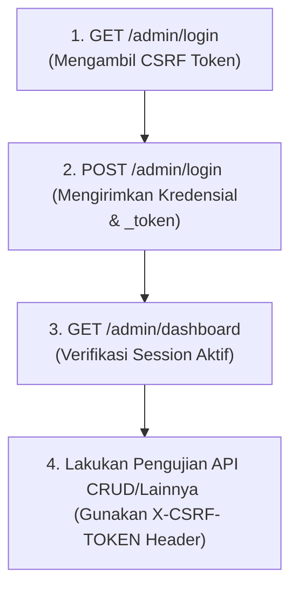

# 🚀 Panduan Pengujian API dengan Postman - Admin Panel

Dokumen ini menyediakan panduan lengkap untuk melakukan pengujian dan interaksi dengan API/Endpoint pada sistem **Admin Panel Smart Tourism**.

---

## 📌 1. Memahami Sistem Autentikasi & CSRF

Sistem Admin Panel ini dibangun menggunakan **Laravel** dengan **Session-based Authentication** (`web` middleware group) menggunakan guard `admin`. Sistem ini **tidak** menggunakan token stateless (seperti JWT atau Laravel Sanctum).

### Karakteristik Autentikasi:
1. **Cookie Session**: Setiap request yang berhasil login akan menyimpan session cookie (`laravel_session`) pada browser atau HTTP Client (Postman).
2. **CSRF Protection**: Laravel melindungi semua request non-GET (`POST`, `PUT`, `PATCH`, `DELETE`) menggunakan middleware `VerifyCsrfToken`. Request tanpa CSRF token yang valid akan menghasilkan error `419 Page Expired`.
3. **AJAX/JSON Response**: Sebagian besar controller pada Admin Panel mendukung format JSON jika request mengirimkan header `Accept: application/json` atau `X-Requested-With: XMLHttpRequest`.

---

## 🛠️ 2. Konfigurasi Postman

Untuk melakukan pengujian API di Postman dengan sukses, ikuti langkah-langkah di bawah ini untuk menangani Autentikasi dan CSRF secara dinamis.

### Langkah 1: Buat Environment di Postman
Buat Environment baru di Postman (misalnya: `Smart Tourism Admin`) dan tambahkan variabel berikut:
* `base_url` : `http://127.0.0.1:8000` (atau URL server Anda)
* `csrf_token` : (kosongkan saja, akan terisi otomatis oleh skrip)

### Langkah 2: Otomatisasi Ekstraksi CSRF Token
Untuk mengambil CSRF token secara otomatis saat mengakses halaman Login, tambahkan skrip berikut pada bagian **Tests** di request `GET {{base_url}}/admin/login` atau di tingkat Collection/Folder:

```javascript
// Skrip untuk Ekstraksi CSRF Token dari Halaman HTML
if (pm.response.code === 200) {
    const responseHtml = pm.response.text();
    
    // Regex untuk mencari _token dari input tersembunyi
    let csrfMatch = responseHtml.match(/name="_token"\s+value="([^"]+)"/) || 
                    responseHtml.match(/value="([^"]+)"\s+name="_token"/) ||
                    responseHtml.match(/content="([^"]+)"\s+name="csrf-token"/) ||
                    responseHtml.match(/name="csrf-token"\s+content="([^"]+)"/);
                      
    if (csrfMatch && csrfMatch.length > 1) {
        const csrfToken = csrfMatch[1];
        pm.environment.set("csrf_token", csrfToken);
        console.log("✅ CSRF Token berhasil diperbarui: " + csrfToken);
    } else {
        console.warn("⚠️ CSRF Token tidak ditemukan di halaman response!");
    }
}
```

### Langkah 3: Gunakan Header CSRF pada Request Mutasi
Untuk setiap request `POST`, `PUT`, `PATCH`, dan `DELETE`, tambahkan header berikut:
* **Key**: `X-CSRF-TOKEN`
* **Value**: `{{csrf_token}}`

Selain itu, pastikan untuk selalu menambahkan header ini agar Laravel merespons dengan JSON apabila terjadi error (seperti kesalahan validasi):
* **Key**: `Accept`
* **Value**: `application/json`

> [!TIP]
> **Postman Cookie Jar** akan secara otomatis mengelola cookie session (`laravel_session` & `XSRF-TOKEN`) setelah Anda berhasil login, sehingga Anda tidak perlu menyalin cookie secara manual untuk setiap request berikutnya.

---

## 📂 3. Alur Kerja Pengujian (Workflow)

Untuk memulai pengujian di Postman, jalankan request dengan urutan berikut:



---

## 📋 4. Daftar Lengkap Endpoint API

Berikut adalah daftar endpoint utama yang dapat diuji melalui Postman. 

### A. Autentikasi (Authentication)

#### 1. Memuat Halaman Login (Dapatkan CSRF)
* **Method**: `GET`
* **URL**: `{{base_url}}/admin/login`
* **Headers**: `Accept: text/html`
* **Skrip (Tests)**: Masukkan skrip ekstraksi CSRF token di atas.

#### 2. Melakukan Login
* **Method**: `POST`
* **URL**: `{{base_url}}/admin/login`
* **Headers**:
  * `Accept: application/json`
  * `Content-Type: application/x-www-form-urlencoded`
* **Body (x-www-form-urlencoded)**:
  * `_token`: `{{csrf_token}}`
  * `email`: `superadmin@smarttourism.local` *(Kredensial Default)*
  * `password`: `SuperAdmin@123` *(Kredensial Default)*
* **Response Sukses**: Redirect ke `/admin/dashboard` atau jika menggunakan AJAX mengembalikan JSON sukses.

#### 3. Melakukan Logout
* **Method**: `POST`
* **URL**: `{{base_url}}/admin/logout`
* **Headers**:
  * `Accept: application/json`
  * `X-CSRF-TOKEN`: `{{csrf_token}}`

---

### B. Dashboard & Analytics

#### 1. Ambil Data Grafik Bulanan Dashboard
* **Method**: `GET`
* **URL**: `{{base_url}}/admin/dashboard/chart-data`
* **Headers**: `Accept: application/json`
* **Response**: Data array bulanan berisi statistik destinasi, kegiatan, review, laporan, dll.

#### 2. Pencarian Global
* **Method**: `GET`
* **URL**: `{{base_url}}/admin/search?q=Danau`
* **Headers**: `Accept: application/json`

---

### C. Destinasi Wisata (Destinations)

#### 1. Ambil Daftar Destinasi
* **Method**: `GET`
* **URL**: `{{base_url}}/admin/destinations?page=1&per_page=10`
* **Headers**: `Accept: application/json`
* **Parameter Opsional (Query)**:
  * `search`: string pencarian
  * `category`: `park`, `beach`, `museum`, `historical`, `nature`, `cultural`, `religi`
  * `status`: `active` atau `inactive`
  * `sort_by`: `name`, `category`, `is_active`, `created_at`
  * `sort_order`: `asc` atau `desc`

#### 2. Ambil Detail Destinasi (Untuk Edit)
* **Method**: `GET`
* **URL**: `{{base_url}}/admin/destinations/{id}/edit`
* **Headers**: `Accept: application/json`

#### 3. Tambah Destinasi Baru
* **Method**: `POST`
* **URL**: `{{base_url}}/admin/destinations`
* **Headers**:
  * `Accept: application/json`
  * `X-CSRF-TOKEN`: `{{csrf_token}}`
* **Body (form-data)**:
  * `name`: Danau Toba Indah
  * `description`: Destinasi wisata danau vulkanik terbesar di Asia Tenggara yang dikelilingi perbukitan hijau.
  * `location`: Samosir, Sumatera Utara
  * `category`: nature
  * `latitude`: 2.6283
  * `longitude`: 98.8166
  * `facilities`: Toilet, Parkir, Restoran, Penginapan
  * `thumbnail`: *(Pilih file gambar)* atau url gambar string
  * `opening_hours`: 24 Jam
  * `ticket_price`: Rp 15.000
  * `best_time`: Pagi hari

#### 4. Update Destinasi
* **Method**: `POST` *(Gunakan POST dengan parameter `_method: PUT` pada form-data karena keterbatasan PHP dalam memproses file upload pada request PUT asli)*
* **URL**: `{{base_url}}/admin/destinations/{id}`
* **Headers**:
  * `Accept: application/json`
  * `X-CSRF-TOKEN`: `{{csrf_token}}`
* **Body (form-data)**:
  * `_method`: `PUT`
  * `name`: Danau Toba Indah (Updated)
  * `description`: Deskripsi yang diperbarui...
  * `location`: Samosir, Sumatera Utara
  * `category`: nature
  * `facilities`: Toilet, Parkir, Gazebo
  * `delete_images[]`: *(Opsional - path gambar yang ingin dihapus)*

#### 5. Soft Delete Destinasi
* **Method**: `DELETE`
* **URL**: `{{base_url}}/admin/destinations/{id}`
* **Headers**:
  * `Accept: application/json`
  * `X-CSRF-TOKEN`: `{{csrf_token}}`

#### 6. Toggle Status Aktif Destinasi
* **Method**: `PATCH`
* **URL**: `{{base_url}}/admin/destinations/{id}/status`
* **Headers**:
  * `Accept: application/json`
  * `X-CSRF-TOKEN`: `{{csrf_token}}`

#### 7. Mengubah Mode Trending Destinasi
* **Method**: `POST`
* **URL**: `{{base_url}}/admin/trending-destinations/mode`
* **Headers**:
  * `Accept: application/json`
  * `X-CSRF-TOKEN`: `{{csrf_token}}`
* **Body (x-www-form-urlencoded)**:
  * `mode`: `manual` atau `automatic`

---

### D. Ulasan & Analisis Sentimen (Reviews)

#### 1. Ambil Daftar Ulasan
* **Method**: `GET`
* **URL**: `{{base_url}}/admin/reviews?status=pending` *(Status: pending, approved, rejected)*
* **Headers**: `Accept: application/json`

#### 2. Statistik Sentimen Ulasan
* **Method**: `GET`
* **URL**: `{{base_url}}/admin/reviews/summary/stats`
* **Headers**: `Accept: application/json`

#### 3. Analisis Sentimen AI (Single Review)
* **Method**: `POST`
* **URL**: `{{base_url}}/admin/reviews/{id}/analyze`
* **Headers**:
  * `Accept: application/json`
  * `X-CSRF-TOKEN`: `{{csrf_token}}`
* **Response**: Hasil klasifikasi sentimen (`positive`, `negative`, `neutral`) dan tingkat keyakinan (confidence score).

#### 4. Analisis Sentimen AI (Batch)
* **Method**: `POST`
* **URL**: `{{base_url}}/admin/reviews/analyze-batch`
* **Headers**:
  * `Accept: application/json`
  * `X-CSRF-TOKEN`: `{{csrf_token}}`

#### 5. Approve Ulasan
* **Method**: `PATCH`
* **URL**: `{{base_url}}/admin/reviews/{id}/approve`
* **Headers**:
  * `Accept: application/json`
  * `X-CSRF-TOKEN`: `{{csrf_token}}`

---

### E. Laporan Pengguna (Reports)

#### 1. Ambil Daftar Laporan Masalah
* **Method**: `GET`
* **URL**: `{{base_url}}/admin/reports`
* **Headers**: `Accept: application/json`

#### 2. Ambil Detail Laporan
* **Method**: `GET`
* **URL**: `{{base_url}}/admin/reports/{id}`
* **Headers**: `Accept: application/json`

#### 3. Ubah Status Laporan (Resolve)
* **Method**: `PATCH`
* **URL**: `{{base_url}}/admin/reports/{id}/resolve`
* **Headers**:
  * `Accept: application/json`
  * `X-CSRF-TOKEN`: `{{csrf_token}}`

---

## 📥 5. Template Postman Collection JSON

Seluruh template Postman Collection lengkap yang mencakup semua pengujian dan modul (Auth, Dashboard, Destinations, Events, Reviews, Reports, Chatbot Logs, Settings, Profile) telah disimpan langsung ke dalam file terpisah agar mudah di-import ke Postman:

👉 **[smart_tourism_admin_panel.postman_collection.json](./smart_tourism_admin_panel.postman_collection.json)**

### Cara Menggunakan File JSON Tersebut:
1. Buka atau unduh file [smart_tourism_admin_panel.postman_collection.json](./smart_tourism_admin_panel.postman_collection.json).
2. Di aplikasi Postman, klik tombol **Import** (di sudut kiri atas).
3. Pilih file tersebut atau seret (drag and drop) file ke jendela Postman.
4. Klik **Import** untuk memuat seluruh folder request pengujian.

---

## 💡 6. Tips Tambahan Pengujian

1. **Gunakan Header `X-Requested-With: XMLHttpRequest`**: Mengirimkan header ini akan memberitahukan Laravel bahwa ini adalah request AJAX, sehingga Laravel secara otomatis memformat response error (misal error `404`, `500`, atau `419`) sebagai data JSON.
2. **Kredensial Default**:
   * Email: `superadmin@smarttourism.local`
   * Password: `SuperAdmin@123`
3. **Melihat Aktivitas / Audit Logs**:
   Setiap operasi CRUD yang dilakukan oleh Admin akan tersimpan pada MongoDB Audit Logs. Anda dapat memverifikasi log aktivitas ini dengan mengirimkan request `GET {{base_url}}/admin/settings/audit-logs`.
