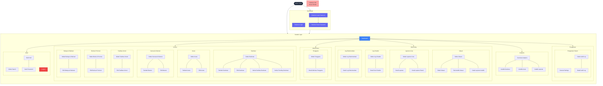

# Sitemap — Admin Panel Smart Tourism Toba

```mermaid
flowchart TD

    ROOT([Admin Panel]) --> AUTH
    ROOT --> MAIN

    %% ═══════════════════════════════════════
    %% AUTENTIKASI
    %% ═══════════════════════════════════════
    subgraph AUTH [Autentikasi]
        direction TB
        A1[Halaman Login]
        A2[Halaman Lupa Password]
        A3[Halaman Reset Password]
        A2 --> A3
    end

    AUTH --> MAIN

    %% ═══════════════════════════════════════
    %% MAIN
    %% ═══════════════════════════════════════
    subgraph MAIN [Setelah Login]
        direction TB

        DASH[Dashboard]

        DASH --> KONTEN
        DASH --> ADMIN_SEC
        DASH --> MONITORING
        DASH --> ANALYTICS
        DASH --> PENGATURAN
        DASH --> AKUN

        %% ─────────────────────────────────
        %% KONTEN
        %% ─────────────────────────────────
        subgraph KONTEN [Konten]
            direction TB

            subgraph S_DEST [Destinasi]
                direction TB
                DEST[Daftar Destinasi]
                DEST --- DEST_ADD[Tambah Destinasi]
                DEST --- DEST_EDIT[Edit Destinasi]
                DEST --- DEST_FAC[Kelola Fasilitas Destinasi]
                DEST --- DEST_TREND[Kelola Trending Destinasi]
            end

            subgraph S_EVT [Acara]
                direction TB
                EVT[Daftar Acara]
                EVT --- EVT_ADD[Tambah Acara]
                EVT --- EVT_EDIT[Edit Acara]
            end

            subgraph S_BAN [Carousel & Banner]
                direction TB
                BAN[Daftar Carousel & Banner]
                BAN --- BAN_ADD[Tambah Banner]
                BAN --- BAN_EDIT[Edit Banner]
            end

            subgraph S_FAS [Fasilitas Umum]
                direction TB
                FAS[Daftar Fasilitas Umum]
                FAS --- FAS_EDIT[Edit Fasilitas Umum]
            end

            subgraph S_BER [Berita & Promosi]
                direction TB
                BER[Daftar Berita & Promosi]
                BER --- BER_EDIT[Edit Berita & Promosi]
            end

            subgraph S_BUD [Budaya & Warisan]
                direction TB
                BUD[Daftar Budaya & Warisan]
                BUD --- BUD_EDIT[Edit Budaya & Warisan]
            end
        end

        %% ─────────────────────────────────
        %% ADMINISTRASI
        %% ─────────────────────────────────
        subgraph ADMIN_SEC [Administrasi]
            subgraph S_USR [Pengguna]
                direction TB
                USR[Daftar Pengguna]
                USR --- USR_ACT[Detail Aktivitas Pengguna]
            end
        end

        %% ─────────────────────────────────
        %% MONITORING
        %% ─────────────────────────────────
        subgraph MONITORING [Monitoring]
            direction TB

            subgraph S_RV [Ulasan]
                direction TB
                RV[Daftar Ulasan]
                RV --- RV_DETAIL[Detail Ulasan]
                RV --- RV_ANALYTICS[Tab Analitik Ulasan]
                RV --- RV_PRINT[Cetak Laporan Analitik]
            end

            subgraph S_RP [Laporan & Isu]
                direction TB
                RP[Daftar Laporan & Isu]
                RP --- RP_DETAIL[Detail Laporan]
                RP --- RP_PRINT[Cetak Laporan Resmi]
            end

            subgraph S_CH [Log Chatbot]
                direction TB
                CH[Daftar Log Chatbot]
                CH --- CH_DETAIL[Detail Sesi Chatbot]
            end

            subgraph S_RC [Log Rekomendasi]
                direction TB
                RC[Daftar Log Rekomendasi]
                RC --- RC_DETAIL[Detail Log Rekomendasi]
            end
        end

        %% ─────────────────────────────────
        %% ANALYTICS
        %% ─────────────────────────────────
        subgraph ANALYTICS [Analytics]
            direction TB
            AN[Overview Analytics]
            AN --- AN_DEST[Analitik Destinasi]
            AN --- AN_EVT[Analitik Acara]
            AN --- AN_RPT[Analitik Laporan]
        end

        %% ─────────────────────────────────
        %% PENGATURAN
        %% ─────────────────────────────────
        subgraph PENGATURAN [Pengaturan]
            direction TB
            subgraph S_SET [Pengaturan Sistem]
                direction TB
                SET[General Settings]
                AUDIT[Daftar Audit Log]
                AUDIT --- AUDIT_DET[Detail Audit Log]
            end
        end

        %% ─────────────────────────────────
        %% AKUN
        %% ─────────────────────────────────
        subgraph AKUN [Akun]
            direction TB
            SEARCH[Global Search]
            PROF[Edit Profil]
            PROF --- PROF_PASS[Ganti Password]
            LOGOUT[Logout]
        end

    end

    %% ─────────────────────────────────
    %% ERROR
    %% ─────────────────────────────────
    ERR[Halaman 403\nAkses Ditolak]

    %% ═══════════════════════════════════════
    %% STYLES
    %% ═══════════════════════════════════════
    style ROOT          fill:#1e293b,stroke:#334155,color:#f8fafc
    style DASH          fill:#3b82f6,stroke:#1d4ed8,color:#fff
    style A1            fill:#6366f1,stroke:#4338ca,color:#fff
    style A2            fill:#6366f1,stroke:#4338ca,color:#fff
    style A3            fill:#6366f1,stroke:#4338ca,color:#fff
    style LOGOUT        fill:#ef4444,stroke:#b91c1c,color:#fff
    style ERR           fill:#fca5a5,stroke:#dc2626
```
